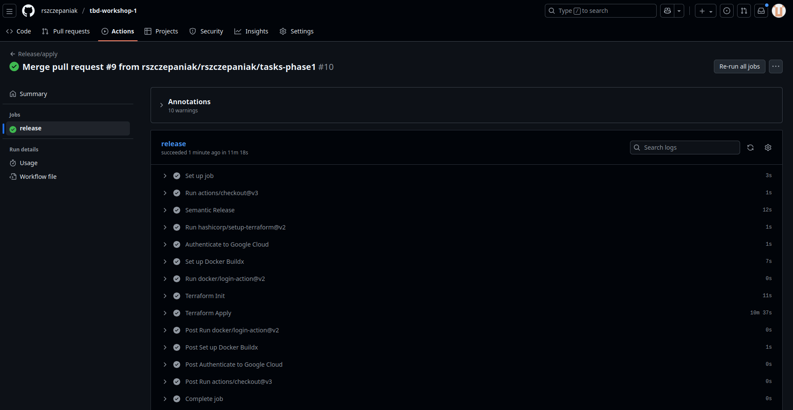
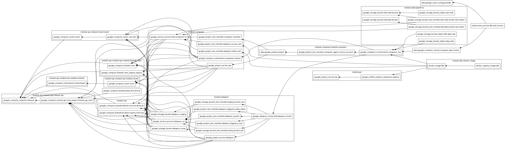
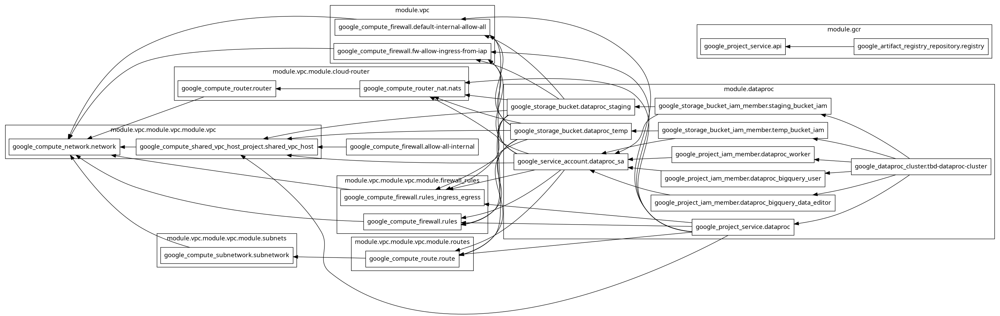
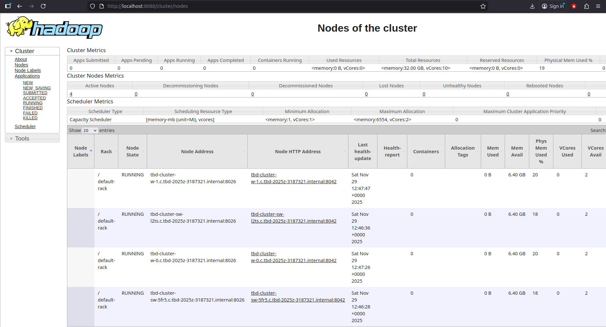
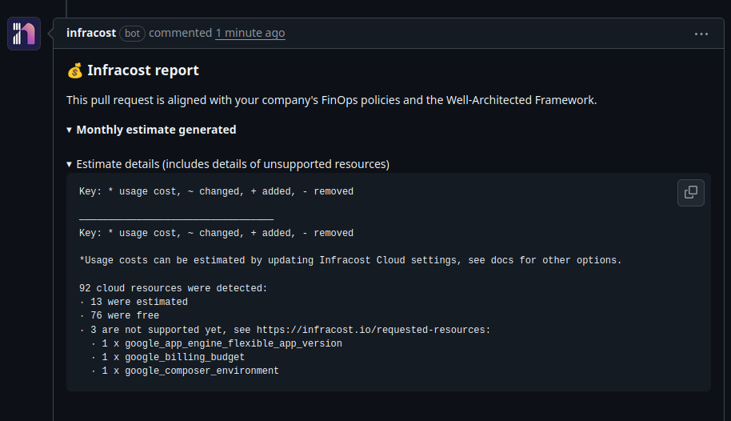
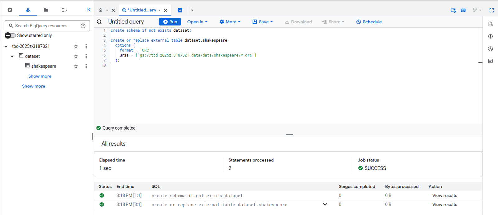
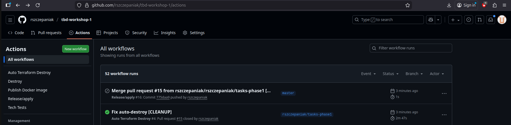

IMPORTANT ❗ ❗ ❗ Please remember to destroy all the resources after each work session. You can recreate infrastructure by creating new PR and merging it to master.
  


1. Authors:

   6

   [***link to forked repo***](https://github.com/rszczepaniak/tbd-workshop-1)
   
2. Follow all steps in README.md.

3. From avaialble Github Actions select and run destroy on main branch.
   
4. Create new git branch and:



5. Analyze terraform code. Play with terraform plan, terraform graph to investigate different modules.

    Moduł composer tworzy zarządzane środowisko Apache Airflow w usłudze Google Cloud Composer, które pełni rolę centralnego orkiestratora pipeline’ów danych. Jest on zależny od sieci VPC (depends_on = module.vpc module.vpc) i tworzy dedykowaną podsieć dla klastra Composera (subnet_address = local.composer_subnet_address). Moduł konfiguruje środowisko Airflow w zadanym projekcie i regionie, przypisuje je do sieci VPC (network = module.vpc.network.network_name) oraz ustawia zmienne środowiskowe umożliwiające integrację z Dataproc, GCS i klastrem GKE wykorzystywanym do zadań dbt i Spark.

    Ze względu na zbyt małą quotę musieliśmy usunąć moduł composer.

    Pełen graph przed usunięciem:
    

    Graph po usunięciu:
    

6. Reach YARN UI

Uruchomiliśmy YARN UI wywołując poniższą komendę:

`gcloud compute ssh tbd-cluster-m --project tbd-2025z-3187321 --zone europe-west1-c -- -L 8088:localhost:8088`
   


7. Draw an architecture diagram (e.g. in draw.io) that includes:
    1. Description of the components of service accounts
    2. List of buckets for disposal
    
    ***place your diagram here***

8. Create a new PR and add costs by entering the expected consumption into Infracost
For all the resources of type: `google_artifact_registry`, `google_storage_bucket`, `google_service_networking_connection` create a sample usage profiles and add it to the Infracost task in CI/CD pipeline. Usage file [example](https://github.com/infracost/infracost/blob/master/infracost-usage-example.yml) 
    
Nasze szacunki:


Komentarz na PR:



9. Create a BigQuery dataset and an external table using SQL
    
Aby zrobić ten krok musiałem manualnie wgrać spark-job.py do kubełka z kodem komendą `gsutil cp ./modules/data-pipeline/resources/spark-job.py gs://tbd-2025z-3187321-code/spark-job.py` a następnie uruchomiłem zadanie komendą `gcloud dataproc jobs submit pyspark gs://tbd-2025z-3187321-code/spark-job.py --cluster=tbd-cluster --region=europe-west1`. Wynika to z tego że `spark-job.py` uruchamiał job w `data-pipeline` zdefiniowany w `main.tf`. Przez to że musiałem zakomentować composera, a data-pipeline używał wyników z composera to plik ten ani nie został wgrany automatycznie ani nie został uruchomiony. Innym rozwiązaniem byłoby dodanie data-pipeline i napisanie na sztywno danych, natomiast patrząc na kod można łatwo zrozumieć że powinien on współpracować z composerem, dlatego zdecydowałem się go nie dodawać.

```
create schema if not exists dataset;

create or replace external table dataset.shakespeare
  options (
    format = 'ORC',
    uris = ['gs://tbd-2025z-3187321-data/data/shakespeare/*.orc']
  );
```
    


Format ORC nie wymaga oddzielnego `table schema` ponieważ zawiera on informacje o swoim schemacie (to jest nazwy kolumn oraz typy danych) wewnątrz pliku. Dzięki temu Big Data może automatycznie tworzyć strukturę danych bez ręcznego definiowania schematu.

10. Find and correct the error in spark-job.py

Problem polegał na tym, że nazwa Bucketa była ustawiona na poprzedni projekt. Został zmieniony na

`DATA_BUCKET = "gs://tbd-2025z-3187321-data/data/shakespeare/"`

Aby przetestować czy skrypt został naprawiony uruchomiłem ręcznie joba tak jak w kroku 9. Skrócony output:
```
...
|  my|         11291|
|  in|         10589|
|  is|          8735|
|that|          8561|
| not|          8395|
|  me|          8030|
| And|          7780|
|with|          7224|
|  it|          7137|
| his|          6811|
|  be|          6724|
|your|          6244|
| for|          6154|
+----+--------------+
only showing top 20 rows

...

  clusterUuid: 1f073855-12af-42c1-9b94-bb484545f3fd
pysparkJob:
  mainPythonFileUri: gs://tbd-2025z-3187321-code/spark-job.py
reference:
  jobId: 8bc2433dc7384d52a071d42f36a6971a
  projectId: tbd-2025z-3187321
status:
  state: DONE
  stateStartTime: '2025-11-29T14:14:30.941191Z'
statusHistory:
- state: PENDING
  stateStartTime: '2025-11-29T14:12:12.634651Z'
- state: SETUP_DONE
  stateStartTime: '2025-11-29T14:12:12.753036Z'
- details: Agent reported job success
  state: RUNNING
  stateStartTime: '2025-11-29T14:12:13.263172Z'
yarnApplications:
- name: Shakespeare WordCount
  progress: 1.0
  state: FINISHED
  trackingUrl: http://tbd-cluster-m.c.tbd-2025z-3187321.internal.:8088/proxy/application_1764419387476_0001/
(tbd) rafal@temeria:~/Desktop/tbd/tbd-workshop-1$ 
```

11. Add support for preemptible/spot instances in a Dataproc cluster

[link to modified file](https://github.com/rszczepaniak/tbd-workshop-1/blob/master/modules/dataproc/main.tf)

Na dole dodaliśmy:

```
preemptible_worker_config {
      num_instances  = 2
      preemptibility = "SPOT"

      disk_config {
        boot_disk_type    = "pd-standard"
        boot_disk_size_gb = 100
      }
    }
```    
    
12. Triggered Terraform Destroy on Schedule or After PR Merge. Goal: make sure we never forget to clean up resources and burn money.

Add a new GitHub Actions workflow that:
  1. runs terraform destroy -auto-approve
  2. triggers automatically:
   
   a) on a fixed schedule (e.g. every day at 20:00 UTC)
   
   b) when a PR is merged to main containing [CLEANUP] tag in title

Steps:
  1. Create file .github/workflows/auto-destroy.yml
  2. Configure it to authenticate and destroy Terraform resources
  3. Test the trigger (schedule or cleanup-tagged PR)

Plik auto-destroy.yml:

```
name: Auto Terraform Destroy

on:
  schedule:
    # Every day at 20:00 UTC
    - cron: "0 20 * * *"
  pull_request:
    types: [closed]
    branches: [master]

permissions: read-all

jobs:
  auto-destroy:
    if: >
      github.event_name == 'schedule' ||
      (github.event_name == 'pull_request' &&
       github.event.pull_request.merged == true &&
       contains(github.event.pull_request.title, '[CLEANUP]'))

    runs-on: ubuntu-latest

    permissions:
      id-token: write

    steps:
      - name: Checkout repo
        uses: actions/checkout@v3

      - name: Set up Terraform
        uses: hashicorp/setup-terraform@v2
        with:
          terraform_version: 1.11.0

      - id: 'auth'
        name: 'Authenticate to Google Cloud'
        uses: 'google-github-actions/auth@v1'
        with:
          token_format: 'access_token'
          workload_identity_provider: ${{ secrets.GCP_WORKLOAD_IDENTITY_PROVIDER_NAME }}
          service_account: ${{ secrets.GCP_WORKLOAD_IDENTITY_SA_EMAIL }}
      
      - name: Terraform Init
        working-directory: .
        run: terraform init -backend-config=env/backend.tfvars

      - name: Terraform Destroy
        working-directory: .
        run: terraform destroy -no-color -var-file env/project.tfvars -auto-approve
        continue-on-error: false
```

Screenshot potwierdzający uruchomienie się joba:



Jak widać na załączonym screenshocie job `release` się nie uruchomił ponieważ w merge commicie jest tag [CLEANUP], a job `auto-destroy` się uruchomił i usunął całą infrastrukturę.

Dlaczego warto zdefiniować taki job?

Ponieważ bez tego joba ktoś mógłby zapomnieć usunąć infrastrukturę na GCP co wtórnie mogłoby poskutkować marnowanymi pieniędzmi.
